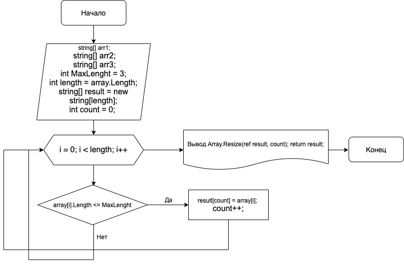

### Итоговая проверочная работа.
## Задача:

 Написать программу, которая из имеющегося массива строк формирует массив из строк, длина которых меньше либо равна 3 символа. Первоначальный массив можно ввести с клавиатуры, либо задать на старте выполнения алгоритма. При решении не рекомендуется пользоваться коллекциями, лучше обойтись исключительно массивами. 

## Алгоритм решения основной содержательной части:

1. Делаем перебор значений из исходного массива.
2. Проверяем каждое значение из массива на соответствие условию: длина строки меньше или равна 3.
3. Если строка удовлетворяет условию, переносим значение в новый массив.
4. Повторяем пункты 2 и 3 до тех пор пока не достигнем конца исходного массива.
5. Возвращаем новый заполненый массив как результат.
## Блок-схема алгоритма:

## Код программы:
using System;
					
public class Program
{
	public static void Main()
	{
        string[] arr1 = {"Hello", "2", "world", ":-)"};
		string[] arr2 = {"1234", "1567", "-2", "computer science"};
		string[] arr3 = {"Russia", "Denmark", "Kazan"};
        
        int MaxLenght = 3;
		
		string[] SearchElements(string[] array)
		{
			int length = array.Length;			
			string[] result = new string[length];
			int count = 0;
			
			for (int i = 0; i < length; i++)
			{
				if(array[i].Length <= MaxLenght)
				{
					result[count] = array[i];
					count++;
				}
			}
			Array.Resize(ref result, count);
			return result;
		}
        void Print(string[] arr)
        {
            if(arr.Length == 0)
				Console.WriteLine("Массив пуст");
            else foreach (var i in arr)
                Console.Write(i + " ");
        }
    void Res(string[] arr)   
    {
        Console.WriteLine("Массив:");
        Print(arr);
	    string[] shortArray = SearchElements(arr);
        Console.WriteLine();
        Console.WriteLine($"В элементе(ах) массива <= {MaxLenght} символов:");
        Print(shortArray);
        Console.WriteLine();
        Console.WriteLine();
    }
    Res(arr1);
    Res(arr2);
    Res(arr3);
    }
}

